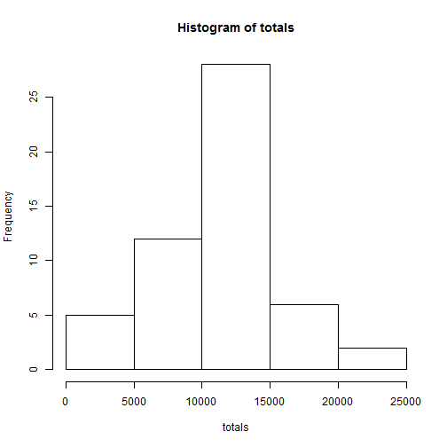
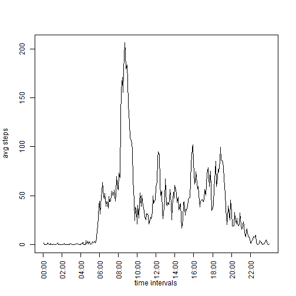
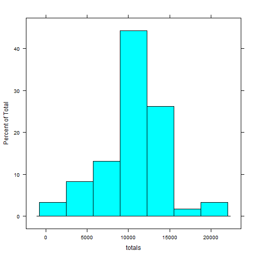
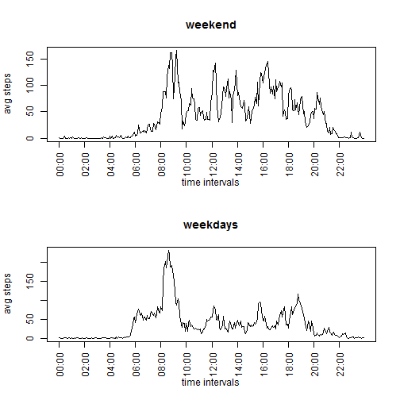

# Reproducible Research: Peer Assessment 1

## Loading and preprocessing the data
### 1. Load the data 
### 2. Process/transform the data
At the end of this code block, I will have two datasets: one that has all the data and one that only has the complete cases, i.e. the rows where "steps" has a value.

```r
# Unzip and read the data. The zip file that is unzipped here is in the same directory as this Rmd file.
data <- read.csv(unz("activity.zip", "activity.csv"), na.strings="NA", stringsAsFactors=FALSE)

# A small (and not very pretty) function to zero-pad the intervals, for easier converting to POSIXlt objects.
padWithZeroes <- function(str) {
        zeroes <- c("0", "00", "000")
        if(nchar(str) < 4) {
                paste(zeroes[4 - nchar(str)], str, sep="")
        }
        else {
                str
        }
}

# Converting the intervals to something that looks more acceptable. For the padWithZeroes function, see the end of this document.
data$interval <- sapply(as.character(data[,"interval"]), padWithZeroes)
data$interval <- format(strptime(data[,"interval"], "%H%M"), "%H:%M")
stepdata <- subset(data, !is.na(steps))
```

## What is mean total number of steps taken per day?
### 1. Make a histogram of the total number of steps taken each day
The following histogram shows the total number of steps taken each day. The rows where "steps" is NA were ignored.

```r
# Using the lattice plotting system for the histograms.
library(lattice)
totals <- sapply(split(stepdata$steps, stepdata$date), sum)
histogram(totals)
```

 

### 2. Calculate and report the mean and median total number of steps taken per day.

The mean total number of steps taken per day is:

```r
round(mean(totals), 0)
```

```
## [1] 10766
```

The median total number of steps taken per day is: 

```r
round(median(totals), 0)
```

```
## [1] 10765
```

## What is the average daily activity pattern?
### 1. Make a time series plot of the 5-minute interval (x-axis) and the average number of steps taken, averaged across all days (y-axis)

The following plot shows the 5-minute interval and the average number of steps taken, averaged across all days. In other words: the average across all days for each time interval.


```r
avgs <- data.frame("average"=sapply(split(stepdata$steps, stepdata$interval), mean),
                   "time"=stepdata$interval[1:288])
plot(x=avgs$time, y=avgs$average, type="l", main="average daily activity pattern", xaxt="n", 
     xlab="Time intervals", ylab="Average number of steps")
lines(avgs$average)
labelpoints <- seq(from=1, to=288, by=288/12)
timelabels <- stepdata[labelpoints, "interval"]
axis(1, labels=timelabels, at=labelpoints, las=3)
```

 

We can see there is generally a lot of activity in the morning, between 8:00 and 10:00 am.

### 2. Which 5-minute interval, on average across all the days in the dataset, contains the maximum number of steps?

The 5-minute interval that contains the highest average number of steps across all days is this one:


```r
avgs[avgs$average == max(avgs$average),]
```

```
##        average  time
## 08:35 206.1698 08:35
```


## Imputing missing values
Note that there are a number of days/intervals where there are missing values (coded as NA). The presence of missing days may introduce bias into some calculations or summaries of the data.
### 1. Calculate and report the total number of missing values in the dataset (i.e. the total number of rows with NAs)

The total number of missing values in the dataset is:


```r
nrow(data) - nrow(stepdata)
```

```
## [1] 2304
```

### 2. Devise a strategy for filling in all of the missing values in the dataset. 
### 3. Create a new dataset that is equal to the original dataset but with the missing data filled in.

We will create a new dataset that is equal to the original dataset but with the missing data filled in. 
We will replace the missing value with the mean for that 5-minute interval.


```r
for (i in seq_len(nrow(data))) {
        if (is.na(data[i, 1])) {
                index <- ifelse(i %% 288 > 0, i %% 288, 288)
                data[i,] <- c(avgs[index, "average"], data[i, 2], data[i, 3])
        }
}
```

### 4. Make a histogram of the total number of steps taken each day

The following histogram shows the total number of steps taken each day, with the missing values replaced by the means for their intervals. 


```r
data$steps  <- as.numeric(data$steps)
totals <- sapply(split(data$steps, data$date), sum)
histogram(totals)
```

 

### Calculate and report the mean and median total number of steps taken per day

After imputing the missing values, the mean total number of steps taken per day is:

```r
round(mean(totals), 0)
```

```
## [1] 10766
```

After imputing the missing values, the median total number of steps taken per day is:

```r
round(median(totals), 0)
```

```
## [1] 10766
```

We can see that imputing the missing values has had very little impact!

## Are there differences in activity patterns between weekdays and weekends?

```r
dotw <- strptime(data$date, "%Y-%m-%d")

for (i in seq_len(nrow(data))) {
        dow <- as.integer(unlist(dotw[i])["wday"])
        if (dow == 0 | dow == 6) {
                data[i, "wd"] <- "weekend"
        }
        else {
                data[i, "wd"] <- "weekday"
        }
}
par(mfrow = c(2, 1))
steps <- split(data, data$wd)
# top
avgsteps <- sapply(split(steps$weekend$steps, steps$weekend$interval), mean)
plot(avgsteps, type="n", xlab="time intervals", ylab="avg steps", main="weekend", col="red", xaxt="n")         
lines(avgsteps, type="l")
axis(1, labels=timelabels, at=labelpoints, las=3)

# bottom
avgsteps <- sapply(split(steps$weekday$steps, steps$weekday$interval), mean)
plot(avgsteps, type="n", xlab="time intervals", ylab="avg steps", main="weekdays", col="blue", xaxt="n")         
lines(avgsteps, type="l")
axis(1, labels=timelabels, at=labelpoints, las=3)
```

 

