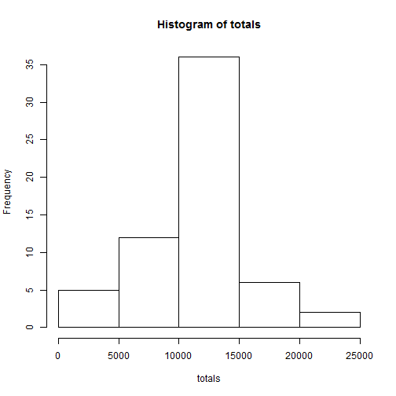
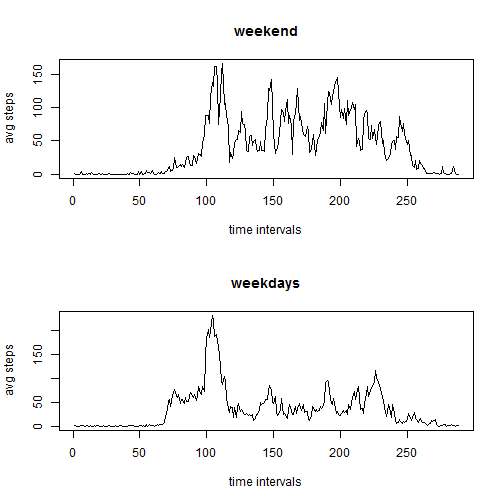

# Reproducible Research: Peer Assessment 1
---
title: "Reproducible Research: Peer Assessment 1"
output: 
  html_document:
    keep_md: true
---


## Loading and preprocessing the data

```r
# Unzip and read the data. The zip file that is unzipped here is in the same directory as this Rmd file.
data <- read.csv(unz("activity.zip", "activity.csv"), na.strings="NA", stringsAsFactors=FALSE)
stepdata <- subset(data, !is.na(data$steps))
```

## What is mean total number of steps taken per day?
The following histogram shows the total number of steps taken each day. We ignore the missing values in the dataset.

```r
totals <- sapply(split(stepdata$steps, stepdata$date, drop=TRUE), sum)
hist(x=totals)
```

 

The mean total number of steps taken per day:

```r
mean(totals)
```

```
## [1] 10766.19
```

The median total number of steps taken per day:

```r
median(totals)
```

```
## [1] 10765
```

## What is the average daily activity pattern?
The following plot shows the 5-minute interval and the average number of steps taken, averaged across all days. In other words: the average across all days for each time interval

```r
avgs <- sapply(split(stepdata$steps, stepdata$interval, drop=TRUE), mean)
plot(avgs, type="n", xlab="time intervals", ylab="avg steps", main="", xaxt="n")         
lines(avgs, type="l")

# not sure if this is part of the assignment but I think I will make some nice x axis labels
times <- seq(from=strptime("00:00", "%H:%M"), to=strptime("23:55", "%H:%M"), by="2 hours")
times <- sapply(times, strftime, "%H:%M")
labelpoints <- seq(from=0, to=264, by=288/12)
axis(1, labels=times, at=labelpoints, las=3)
```

 

## Imputing missing values
Note that there are a number of days/intervals where there are missing values (coded as NA). The presence of missing days may introduce bias into some calculations or summaries of the data.

The total number of missing values in the dataset:

```r
missing <- subset(data, is.na(data$steps))
nrow(missing)
```

```
## [1] 2304
```

We will create a new dataset that is equal to the original dataset but with the missing data filled in. 
We will replace the missing value with the mean for that 5-minute interval.

```r
for (i in seq_len(nrow(data))) {
        if (is.na(data[i, 1])) {
                index <- ifelse(i %% 288 > 0, i %% 288, 288)
                data[i,] <- c(avgs[index], data[i, 2], data[i, 3])
        }
}
```

The following histogram shows the total number of steps taken each day, with the missing values replaced by the means for their intervals. 

```r
data$steps  <- as.numeric(data$steps)
totals <- sapply(split(data$steps, data$date, drop=TRUE), sum)
hist(x=totals)
```

 

The mean total number of steps taken per day. 

```r
mean(totals)
```

```
## [1] 10766.19
```

The median total number of steps taken per day. 

```r
median(totals)
```

```
## [1] 10766.19
```

## Are there differences in activity patterns between weekdays and weekends?

```r
dotw <- strptime(data$date, "%Y-%m-%d")

for (i in seq_len(nrow(data))) {
        dow <- as.integer(unlist(dotw[i])["wday"])
        if (dow == 0 | dow == 6) {
                data[i, "wd"] <- "weekend"
        }
        else {
                data[i, "wd"] <- "weekday"
        }
}
par(mfrow = c(2, 1))
steps <- split(data, data$wd)
# top
avgsteps <- sapply(split(steps$weekend$steps, steps$weekend$interval), mean)
plot(avgsteps, type="n", xlab="time intervals", ylab="avg steps", main="weekend")         
lines(avgsteps, type="l")

# bottom
avgsteps <- sapply(split(steps$weekday$steps, steps$weekday$interval), mean)
plot(avgsteps, type="n", xlab="time intervals", ylab="avg steps", main="weekdays")         
lines(avgsteps, type="l")
```

 
